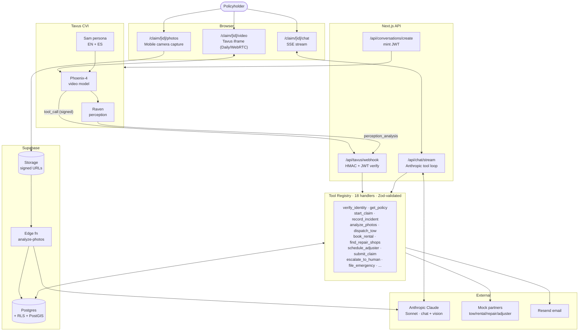
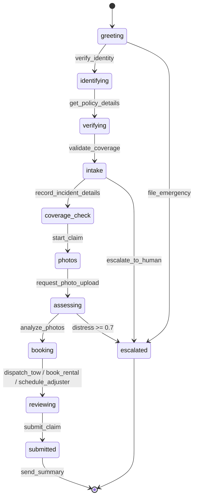
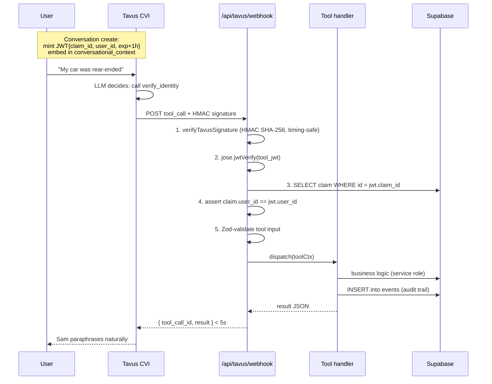

# FNOL — High-Level Overview

A 5-minute read for stakeholders. For implementation depth, see
[`architecture.md`](architecture.md).

---

## What it is

An AI **First-Notice-of-Loss** intake agent for Acme Insurance. A
policyholder signs in via magic link and is greeted by **Sam**, a
Tavus CVI video agent, who walks them through filing an auto, home, or
renters claim end-to-end — identity, coverage, intake, photos with
vision-based damage assessment, partner bookings (tow/rental/repair/
adjuster), and submission. A text-chat fallback runs the same toolset
against Anthropic Claude.

---

## Tech stack

| Layer | Choice | Why |
|---|---|---|
| Framework | Next.js 14 App Router on Vercel | RSC + edge middleware, one repo for UI + API |
| Conversational video | **Tavus CVI** (Phoenix-4 + Daily WebRTC) | Real-time photoreal agent with sub-second turn-taking |
| Perception | **Tavus Raven** | Distress, gaze, environment signals |
| Chat brain | Anthropic Claude Sonnet (tool use) | Same 18-tool registry as Tavus |
| Vision | Anthropic Claude Sonnet (multimodal) | Photo damage assessment → strict JSON |
| Data / Auth / Storage | Supabase (Postgres + RLS, Auth, Storage, PostGIS) | One vendor for the entire data plane |
| Validation | Zod | Single source of truth for tool I/O |
| Tool auth | `jose` JWT (HS256, 1h) | Per-conversation caller binding for webhooks |
| Email / Rate limit / Analytics | Resend / Upstash Redis / PostHog | Feature-flagged — no-op when env absent |
| LLM observability | Helicone | Drop-in proxy for spend + latency |
| Runtime / PM | bun | Faster installs, native TS |

---

## System architecture

**Two interfaces, one tool registry, one database.** The same Zod
schemas define inputs/outputs for both video and chat — zero drift.

---

## Claim flow

Stages flow strictly forward. A pure state machine
(`lib/claims/state-machine.ts`) derives objectives from DB state after
every mutating tool call — Sam can't skip ahead.

---

## Trust boundary on every tool call

RLS is the floor; per-tool caller-vs-claim ownership is the
defense-in-depth wall on top.

---

## Where Tavus creates value

| Tavus feature | What it gives us | Business value |
|---|---|---|
| **Phoenix-4 photoreal video** | A face, not a chatbox. Sub-second latency, natural turn-taking, lip-sync. | Trust + empathy at the worst moment of a customer's day. NPS lift vs. an IVR or text bot is the whole pitch. |
| **CVI tool calling** | Sam invokes our 18-tool registry mid-conversation — same surface as Anthropic tool-use. | No "transfer to agent." Identity check, coverage validation, tow dispatch, photo upload, claim submit all happen *during* the conversation. |
| **Raven perception** | Per-turn distress score + gaze/environment signals streamed via webhook. | At `score >= 0.7` we flip `sessions.distress_flagged`, log an event, and Sam softens pacing + offers a supervisor. Empathy that scales. |
| **Conversational context** | Arbitrary JSON injected at conversation create, echoed back on every tool call. | Carrier of our **tool JWT** — short-lived, claim-scoped, HMAC-verified. Lets us authenticate every tool callback without Tavus knowing our auth model. |
| **Memory / returning-user hint** | Recap last claim state in the persona context. | "Welcome back — last time we were waiting on adjuster photos. Want to pick up there?" Reduces re-explanation friction. |
| **Multi-persona by language** | Two native-language personas (EN / ES) keyed by `users.preferred_lang`. | Spanish parity is a native experience, not a translation layer. Routed via `personaIdFor(locale)`. |
| **Signed webhooks** | HMAC-SHA256 on every callback. | Lets us trust Tavus → us without a private network. Pairs with our JWT for end-to-end caller binding. |
| **Daily WebRTC transport** | Reliable real-time A/V baked in. | We never touch SFUs, ICE, or jitter buffers. Ship to mobile + desktop from day one. |
| **Recording URL on session end** | `conversation.ended` event carries the artifact. | Compliance + QA review without building our own recorder. |

### Why it matters for FNOL specifically

Filing a claim is a **high-anxiety, high-friction** event. The
traditional path — phone tree → human agent → callback queue →
adjuster scheduling — averages days. With Tavus:

1. **Time-to-first-resolution drops from days to one session.**
   Identity, coverage check, tow dispatch, rental booking, and
   submission all happen in a single conversation.
2. **Empathy is observable.** Raven distress flags let us soften
   pacing or escalate to a human *before* the customer asks.
3. **Cost per claim falls** without sacrificing CX, because the agent
   handles long-tail intake variability that rule-based IVRs can't.
4. **Same agent, two surfaces.** Customers who can't or won't do video
   get an identical experience in chat — no feature gap, no second
   prompt to maintain.

---

## What's mocked vs real

| Real | Mocked |
|---|---|
| Tavus persona + conversation API | Tow / rental / repair / adjuster (deterministic latency, vendor-flavored confirmation codes) |
| Supabase Postgres + Auth + Storage + RLS | Email when no Resend creds (logs to stdout) |
| Anthropic Claude Sonnet (chat + vision) | PostHog / Helicone / Upstash when env unset (no-op) |
| HMAC webhook verification | "Last 4 SSN" verification (captured but not checked) |
| PostGIS proximity search | Push notifications (service worker only) |

The **"feature flag if env present"** pattern means a fresh checkout
boots and runs end-to-end with only Tavus, Supabase, and Anthropic
credentials. Production swaps are one-file changes — call sites only
see the interface.
